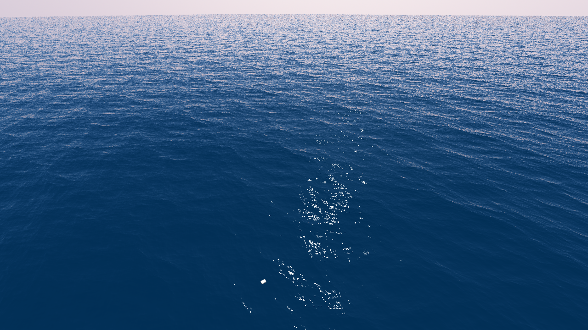
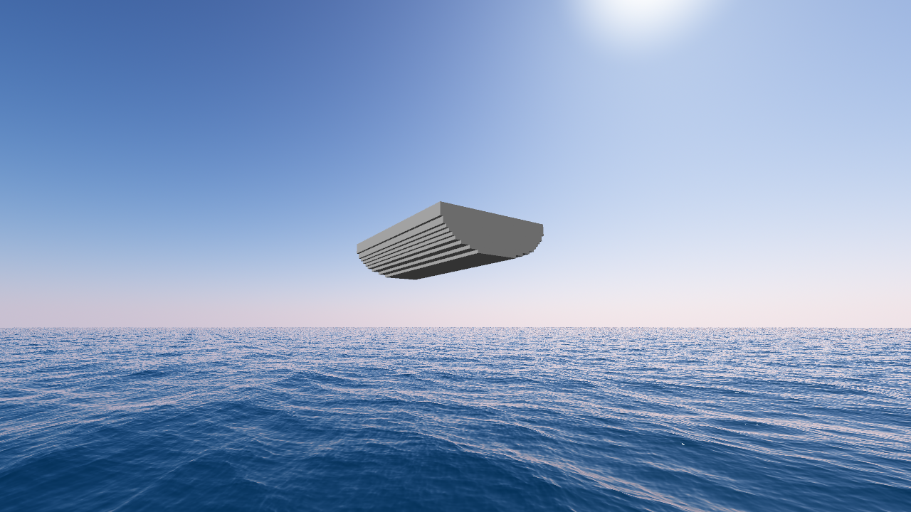

# Boatgame
A sailing simulator using fft-water, and voxels for buoyancy.

## Goals
 - [x] Atmospheric Scattering
 - [x] FFT-water using compute shaders
 - [x] Hollow mesh voxelization on gpu
 - [ ] Filled voxelization
 - [ ] Buoyancy using voxels (implementation started but not working well)
 - [ ] Hide water tiling
 - [ ] Sail physics (not cloth physics)
 - [ ] Boat building similar to Kerbal Space Program
 - [ ] Multiplayer? :^)
 
## Screenshots

